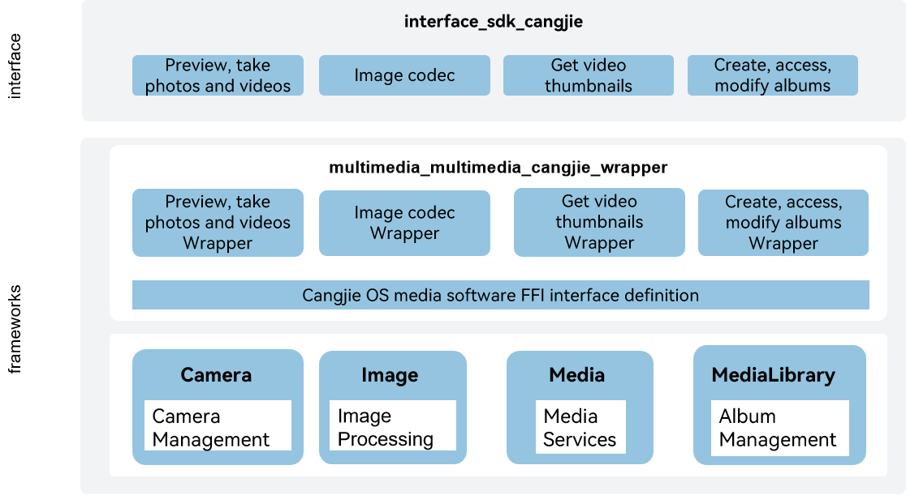

# multimedia_cangjie_wrapper

## Introduction

The Cangjie API is a Cangjie API encapsulated on OpenHarmony based on the capabilities of the media subsystem. The media subsystem provides developers with a simple and easy-to-understand interface, allowing them to easily access the system and use the system's media resources. The Cangjie interface of the OS media software includes pictures, cameras, albums, and video-related media services. The currently open OS media software Cangjie interface only supports standard devices.

## System Architecture

**Figure 1** OS media software Cangjie architecture diagram



As shown in the architecture diagram:

- Preview, take photos and videos: Provide a camera operation interface to support preview, take photos and record videos.
- Image Codec: Supports the encoding and decoding of common image formats.
- Get Video Thumbnails: Provide apps with the ability to get video thumbnails.
- Create, access, and modify albums: Supports local and distributed media data creation, access, and modification of albums.
- Cangjie OS Media Software FFI Interface Definition: Responsible for defining the C interoperability Cangjie interface, which is used to realize the Cangjie OS media software capabilities.
- Camera Management: Responsible for providing basic camera functions, and providing C-interface to Cangjie for interoperability.
- Image Processing: Responsible for providing basic image functions, and providing the package C interface to Cangjie for interoperability.
- Media Services: Responsible for providing basic media functions, encapsulating C interfaces for Cangjie for interoperability.
- Album Management: Responsible for providing the basic functions of the album, and providing the package C interface to Cangjie for interoperability.

## Directory Structure

The structure of the repository directory is as follows:

```
foundation/multimedia/multimedia_cangjie_wrapper
├── figures             # architecture pictures
├── kit                 # Cangjie Multimedia Kit interface
│   ├── CameraKit
│   ├── ImageKit
│   ├── MediaKit
│   └── MediaLibraryKit
├── ohos                # Cangjie Multimedia code
│   ├── file
│   └── multimedia
└── test                # Cangjie test cases
```

## Usage Guidelines

The current OS media software Cangjie interface provides the following functions:

- Preview, take photos and videos.
- Get picture information.
- Image codec.
- Get video thumbnails.
- Create, access, modify albums.

Compared with ArkTS, the following functions are not supported at the moment:

- Multi-graph objects.
- Image metadata.
- Audio and video playback.
- Audio and video recording.
- Video transcoding.
- Get audio and video metadata.
- Screen recording.

See Camera APIs[ohos.multimedia.camera (Camera Management)](https://gitcode.com/openharmony-sig/arkcompiler_cangjie_ark_interop/blob/master/doc/API_Reference/source_en/apis/CameraKit/cj-apis-multimedia-camera.md).For guidance, please refer to[Camera Development Guide](https://gitcode.com/openharmony-sig/arkcompiler_cangjie_ark_interop/blob/master/doc/Dev_Guide/source_en/media/camera/cj-camera-overview.md).

See Image APIs[ohos.multimedia.image (Image Processing)](https://gitcode.com/openharmony-sig/arkcompiler_cangjie_ark_interop/blob/master/doc/API_Reference/source_en/apis/ImageKit/cj-apis-image.md).For guidance, please refer to[Image Development Guide](https://gitcode.com/openharmony-sig/arkcompiler_cangjie_ark_interop/blob/master/doc/Dev_Guide/source_en/media/image/cj-image-overview.md).

See Media APIs[ohos.multimedia.media (Media Service)](https://gitcode.com/openharmony-sig/arkcompiler_cangjie_ark_interop/blob/master/doc/API_Reference/source_en/apis/MediaKit/cj-apis-multimedia_media.md).For guidance, please refer to[Media Development Guide](https://gitcode.com/openharmony-sig/arkcompiler_cangjie_ark_interop/blob/master/doc/Dev_Guide/source_en/media/media/cj-media-kit-intro.md).

See MediaLibrary APIs[ohos.multimedia.photo_accesshelper (Photo Album Management Module)](https://gitcode.com/openharmony-sig/arkcompiler_cangjie_ark_interop/blob/master/doc/API_Reference/source_en/apis/MediaLibraryKit/cj-apis-multimedia-photo_accesshelper.md).For guidance, please refer to[Photo Album Development Guide](https://gitcode.com/openharmony-sig/arkcompiler_cangjie_ark_interop/blob/master/doc/Dev_Guide/source_en/media/medialibrary/cj-photoAccessHelper-systemAlbum-guidelines.md).

## Constraints

Hardware-based decoding and encoding functions of audio and video data are device-specific.

## Code Contribution

Developers are welcome to contribute code, documentation, etc. For specific contribution processes and methods, please refer to [Code Contribution](https://gitcode.com/openharmony/docs/blob/master/en/contribute/code-contribution.md).

## Repositories Involved

[ability\_cangjie\_wrapper](https://gitcode.com/openharmony-sig/ability_ability_cangjie_wrapper)

[bundlemanager\_cangjie\_wrapper](https://gitcode.com/openharmony-sig/bundlemanager_bundlemanager_cangjie_wrapper)

[distributeddatamgr\_cangjie\_wrapper](https://gitcode.com/openharmony-sig/distributeddatamgr_distributeddatamgr_cangjie_wrapper)

[global\_cangjie\_wrapper](https://gitcode.com/openharmony-sig/global_global_cangjie_wrapper)

[graphic\_cangjie\_wrapper](https://gitcode.com/openharmony-sig/graphic_graphic_cangjie_wrapper)

[multimedia\_camera\_framework](https://gitee.com/openharmony/multimedia_camera_framework/blob/master/README.md)

[multimedia\_image\_framework](https://gitee.com/openharmony/multimedia_image_framework/blob/master/README.md)

[multimedia\_media\_library](https://gitee.com/openharmony/multimedia_media_library/blob/master/README.md)

[multimedia\_player\_framework](https://gitee.com/openharmony/multimedia_player_framework/blob/master/README.md)
