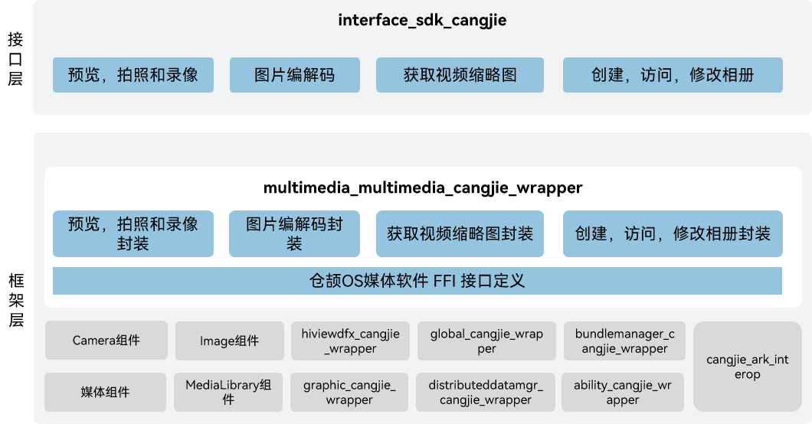

# 媒体仓颉

## 简介

媒体仓颉为开发者提供一套简单且易于理解的接口，使得开发者能够方便接入系统并使用系统的媒体资源。

媒体仓颉包含了音视频、相机相关媒体业务，提供以下常用功能：

-   音频播放和录制。
-   视频播放和录制。
-   相机拍照和录制。

## 系统架构

**图 1**  OpenHarmony媒体仓颉架构图



- **Media**: 为应用提供播放、录制等接口，通过跨进程调用或直接调用方式，调用媒体引擎Gstreamer、Histreamer或其它引擎。
  - mini设备上，Media部件调用Histreamer支持音频播放等功能。
  - small设备上，Media部件调用recorder_lite支持音视频录制，默认调用player_lite支持音视频播放，通过设置系统属性变量debug.media_service.histreamer为1使用histreamer。
  - standard设备上，Media部件调用Gstreamer支持音视频播放、音视频录制。
- **Audio**: Audio部件支持音频输入输出、策略管理、音频焦点管理等功能。
- **Camera**: Camera部件提供相机操作接口，支持预览、拍照、录像。
- **Image**: Image部件支持常见图片格式的编解码。
- **MediaLibrary**: MediaLibrary支持本地和分布式媒体数据访问管理。
- **Histreamer**: 轻量级媒体引擎，支持文件/网络流媒体输入，支持音视频解码播放，支持音视频编码录制，支持插件扩展。
- **Gstreamer**: 开源GStreamer引擎，支持流媒体、音视频播放、录制等功能。

## 目录

仓目录结构如下：

```
foundation/multimedia/multimedia_cangjie_wrapper
├── ohos             # 仓颉媒体接口实现
├── kit              # 仓颉kit化代码
├── figures          # 存放readme中的架构图
```

## 约束

部分音视频格式的硬件编码、解码功能依赖设备的支持。

## 使用说明

如架构图示意，媒体提供了三大类功能接口，开发者可以根据使用诉求，综合使用一类或多类接口：

-   应用开发者使用媒体接口实现录像、预览和播放音视频。
-   当使用简单播放录制功能时，可以使用Player和Recorder快速完成播放和录制功能。
-   提供了一组控制相机的有效接口，可以让用户方便开发使用相机。
-   开发者先创建camerakit组件对象，注册各种事件回调，这些事件回调是用来响应多媒体模块中事件响应的，之后调用创建camera就可以创建一个操作camera资源的对象，使用这个对象可以启动预览、录像或抓拍取流，及设置取流的相关参数。

## 安装

请提前加载内核及相关驱动，参考内核及驱动子系统readme。

## 相关仓

multimedia_cangjie_wrapper