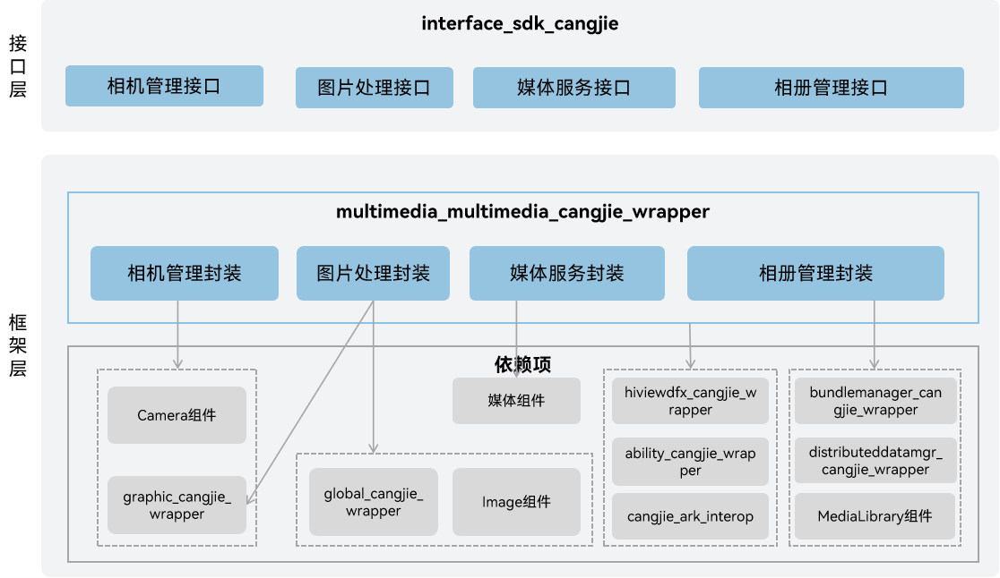

# OS媒体软件仓颉接口

## 简介

OS媒体软件仓颉接口是在OpenHarmony上基于媒体子系统能力之上封装的仓颉API。媒体子系统为开发者提供一套简单且易于理解的接口，使得开发者能够方便地接入系统并使用系统的媒体资源。OS媒体软件仓颉接口包含了图片，相机，相册，视频相关媒体业务。当前开放的OS媒体软件仓颉接口仅支持standard设备。

## 系统架构

**图 1** OS媒体软件仓颉架构图



如架构图所示：

- 预览，拍照和录像：提供相机操作接口，支持预览、拍照、录像。
- 图片编解码：支持常见图片格式的编解码。
- 获取视频缩略图：为应用提供获取视频缩略图的功能。
- 创建，访问，修改相册：支持本地和分布式媒体数据创建，访问，修改相册。
- 仓颉OS媒体软件FFI接口定义：负责定义C互操作仓颉接口，用于实现仓颉OS媒体软件能力。
- 相机管理：负责提供相机基础功能，封装C接口提供给仓颉进行互操作。
- 图片处理：负责提供图片基础功能，封装C接口提供给仓颉进行互操作。
- 媒体服务：负责提供媒体基础功能，封装C接口提供给仓颉进行互操作。
- 相册管理：负责提供相册基础功能，封装C接口提供给仓颉进行互操作。

## 目录

仓目录结构如下：

```
foundation/multimedia/multimedia_cangjie_wrapper
├── figures             # 存放README中的架构图
├── kit                 # 仓颉媒体kit化接口
│   ├── CameraKit
│   ├── ImageKit
│   ├── MediaKit
│   └── MediaLibraryKit
└── ohos                # 仓颉媒体接口实现
    ├── file
    └── multimedia
```

## 使用说明

当前OS媒体软件仓颉接口提供了以下功能：

- 预览，拍照和录像。
- 获取图片信息。
- 图片编解码。
- 获取视频缩略图。
- 创建，访问，修改相册。

与ArkTS相比，暂不支持以下功能：

- 多图对象。
- 图像元数据。
- 音视频播放。
- 音视频录制。
- 视频转码。
- 获取音视频元数据。
- 屏幕录制。

Camera相关API请参见[ohos.multimedia.camera（相机管理）](https://gitcode.com/openharmony-sig/arkcompiler_cangjie_ark_interop/blob/master/doc/API_Reference/source_zh_cn/apis/CameraKit/cj-apis-multimedia-camera.md)，相关指导请参见[相机开发指南](https://gitcode.com/openharmony-sig/arkcompiler_cangjie_ark_interop/blob/master/doc/Dev_Guide/source_zh_cn/media/camera/cj-camera-preparation.md)。

Image相关API请参见[ohos.multimedia.image（图片处理）](https://gitcode.com/openharmony-sig/arkcompiler_cangjie_ark_interop/blob/master/doc/API_Reference/source_zh_cn/apis/ImageKit/cj-apis-image.md)，相关指导请参见[图片开发指南](https://gitcode.com/openharmony-sig/arkcompiler_cangjie_ark_interop/blob/master/doc/Dev_Guide/source_zh_cn/media/image/cj-image-overview.md)。

Media相关API请参见[ohos.multimedia.media（媒体服务）](https://gitcode.com/openharmony-sig/arkcompiler_cangjie_ark_interop/blob/master/doc/API_Reference/source_zh_cn/apis/MediaKit/cj-apis-multimedia_media.md)，相关指导请参见[媒体开发指南](https://gitcode.com/openharmony-sig/arkcompiler_cangjie_ark_interop/blob/master/doc/Dev_Guide/source_zh_cn/media/media/cj-media-kit-intro.md)。

MediaLibrary相关API请参见[ohos.file.photo_access_helper（相册管理模块）](https://gitcode.com/openharmony-sig/arkcompiler_cangjie_ark_interop/blob/master/doc/API_Reference/source_zh_cn/apis/MediaLibraryKit/cj-apis-multimedia-photo_accesshelper.md)，相关指导请参见[相册开发指南](https://gitcode.com/openharmony-sig/arkcompiler_cangjie_ark_interop/blob/master/doc/Dev_Guide/source_zh_cn/media/medialibrary/cj-photoAccessHelper-systemAlbum-guidelines.md)。

## 约束

部分音视频格式的硬件编码、解码功能依赖设备的支持。

## 参与贡献

欢迎广大开发者贡献代码、文档等，具体的贡献流程和方式请参见[参与贡献](https://gitcode.com/openharmony/docs/blob/master/zh-cn/contribute/%E5%8F%82%E4%B8%8E%E8%B4%A1%E7%8C%AE.md)。

## 相关仓

[ability\_cangjie\_wrapper](https://gitcode.com/openharmony-sig/ability_ability_cangjie_wrapper)

[bundlemanager\_cangjie\_wrapper](https://gitcode.com/openharmony-sig/bundlemanager_bundlemanager_cangjie_wrapper)

[cangjie\_ark\_interop](https://gitcode.com/openharmony-sig/arkcompiler_cangjie_ark_interop)

[distributeddatamgr\_cangjie\_wrapper](https://gitcode.com/openharmony-sig/distributeddatamgr_distributeddatamgr_cangjie_wrapper)

[global\_cangjie\_wrapper](https://gitcode.com/openharmony-sig/global_global_cangjie_wrapper)

[graphic\_cangjie\_wrapper](https://gitcode.com/openharmony-sig/graphic_graphic_cangjie_wrapper)

[hiviewdfx\_cangjie\_wrapper](https://gitcode.com/openharmony-sig/hiviewdfx_hiviewdfx_cangjie_wrapper)

[multimedia\_camera\_framework](https://gitee.com/openharmony/multimedia_camera_framework/blob/master/README.md)

[multimedia\_image\_framework](https://gitee.com/openharmony/multimedia_image_framework/blob/master/README.md)

[multimedia\_media\_library](https://gitee.com/openharmony/multimedia_media_library/blob/master/README.md)

[multimedia\_player\_framework](https://gitee.com/openharmony/multimedia_player_framework/blob/master/README.md)
